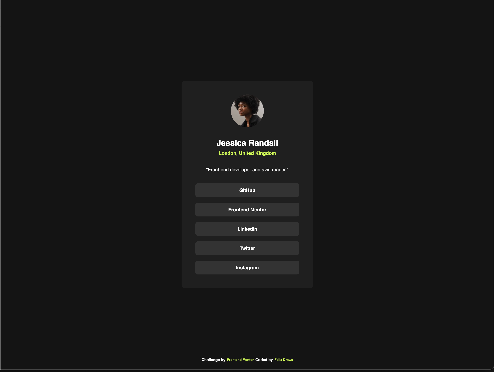
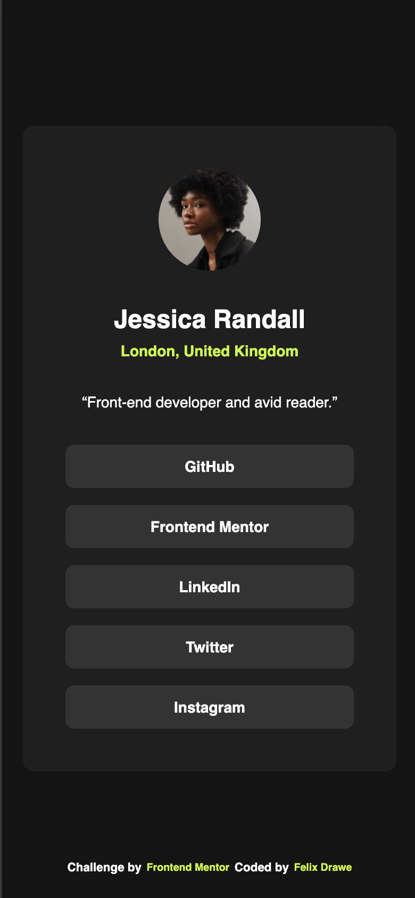

# Frontend Mentor - QR code component solution

This is a solution to the [QR code component challenge on Frontend Mentor](https://www.frontendmentor.io/challenges/blog-preview-card-ckPaj01IcS).

## Table of contents

- [Frontend Mentor - QR code component solution](#frontend-mentor---qr-code-component-solution)
  - [Table of contents](#table-of-contents)
    - [Screenshots](#screenshots)
  - [Desktop](#desktop)
  - [Mobile](#mobile)
    - [Links](#links)
    - [Built with](#built-with)
  - [Author](#author)

### Screenshots

## Desktop

## Mobile

### Links

- Solution URL: https://www.frontendmentor.io/solutions/blog-preview-card-yx4YQSPW5A
- Live Site URL: https://felixdrawe.github.io/blog-preview-card/

### Built with

- Semantic HTML5 markup
- CSS custom properties
- Flexbox

## Author

- Website - [Felix Drawe](https://www.felixdrawe.de)
- Frontend Mentor - [Felix Drawe](https://www.frontendmentor.io/profile/Felixdrawe)
